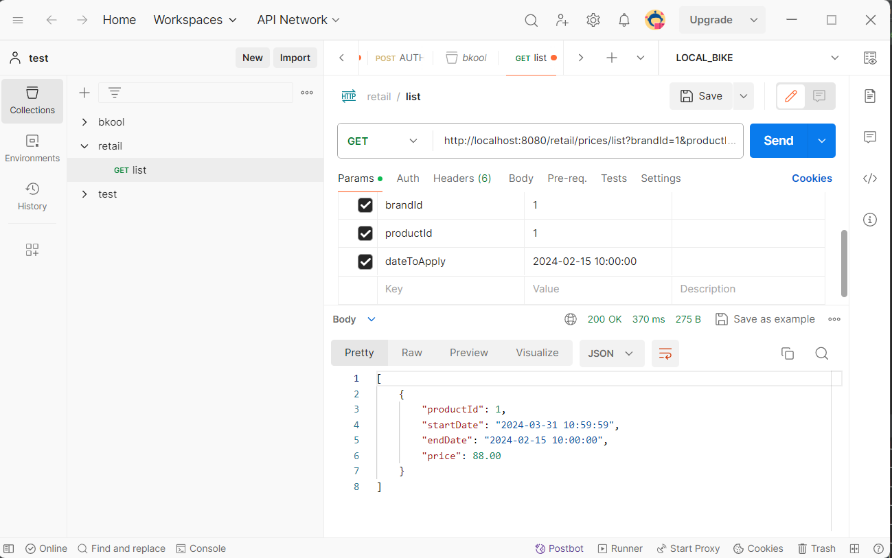

# retail

Api que consulta datos en una bd H2 en memoria

# Caracteristicas del micro servicio:

    1. Java Springboot 
    2. arquitectura Hexagonal
    3. Docker file - Docker compose
    4. cache con caffeine 
    5. Swagger
    6. Base de datos en Memoria (H2)
    7. Test Unitarios con mockito/ Junit

## Tabla de Contenidos

- [Instalación](#instalación)
- [Uso](#uso)
- [Configuración](#configuración)
- [Contribución](#contribución)
- [Directorio de Archivos](#directorio-de-archivos)
- [Licencia](#licencia)

## Instalación
    Es necesario tener un minomo de requerimientos para el entorno

    1. Tener JAVA y Maven instalado en el ordenador
    2. ejecutar el comando 'mvn clean install'
    3. ejecutar el comando ' mvn spring-boot:run'

## Uso

- [Swagger](#http://localhost:8080/swagger-ui/index.html)

  para acceder a swagger  se debera utilizar usuario y contraseña.

## datos esperados en postman

